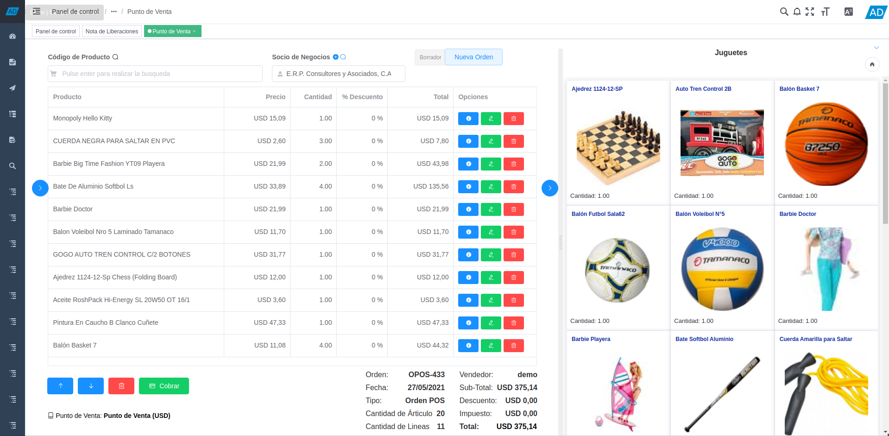

<p align="center">
  
</p>

<p align="center">
  <a href="https://github.com/vuejs/vue">
    
  </a>
  <a href="https://github.com/ElemeFE/element">
    
  </a>
  <a href="https://hub.docker.com/r/erpya/adempiere-vue/">
    
  </a>
  <a href="https://github.com/adempiere/adempiere-vue/actions/workflows/publish.yml">
    
  </a>
  <a href="https://github.com/adempiere/adempiere-vue/blob/master/LICENSE">
    
  </a>
  <a href="https://github.com/adempiere/adempiere-vue/releases/latest">
    
  </a>
  <a href="https://gitter.im/adempiere/adempiere-vue">
    
  </a>
</p>


Español | [Inglés](./README.md)

## Introducción

[adempiere-vue](https://github.com/adempiere/adempiere-vue) es una nueva UI para [ADempiere ERP, CRM & SCM](https://github.com/adempiere/adempiere)]. Está basada en [vue](https://github.com/vuejs/vue) y usa [element-ui](https://github.com/ElemeFE/element) como conjunto de herramientas de interfaz de usuario.



Este es una gran UI para [ADempiere ERP, CRM & SCM](https://github.com/adempiere/adempiere) basada en lo último desarrollado por vue, construido con i18n para manejo multi-idioma, plantillas para aplicaciones de negocio y muchas características asombrosas. Este proyecto es derivado de [Vue-Element-Admin](https://github.com/PanJiaChen/vue-element-admin) originalmente escrito por [PanJiaChen / 花裤衩](https://github.com/PanJiaChen) sobre [licencia MIT](https://github.com/PanJiaChen/vue-element-admin/blob/master/LICENSE) y cambiado a [licencia GNU/GPL v3](https://github.com/adempiere/adempiere-vue/blob/master/LICENSE) por [Yamel Senih](https://github.com/yamelsenih) después de derivar el proyecto y con permisos del autor original [PanJiaChen / 花裤衩](https://github.com/PanJiaChen) en el reporte ["Extend as GNU/Gpl v3 License #1434"](https://github.com/PanJiaChen/vue-element-admin/issues/1434).

[adempiere-vue](https://github.com/adempiere/adempiere-vue) usa como RPC (Llamado a Procedimientos Remotos)[gRPC](https://grpc.io/) como [server](https://github.com/adempiere/adempiere-gRPC-Server).

- [Vista Prévia de la Aplicación](https://demo-ui.erpya.com/)

  - **User**: demo
  - **Password**: demo

- [Documentación](https://adempiere.github.io/adempiere-vue-site/)

- [Canal de Gitter](https://gitter.im/adempiere/adempiere-vue)

- [Para Donaciones](https://www.paypal.me/YamelSenih)

- [Enlace de Wiki](http://wiki.adempiere.io/ADempiere_ERP)

- [Derivado De](https://github.com/PanJiaChen/vue-element-admin)

**La versión actual `v1.0+` está construida con `vue-cli`. Si encuentra algún problema, por favor escriba un [reporte de error](https://github.com/adempiere/adempiere-vue/issues/new).**

**Este proyecto no está soportado para versiones muy viejas de navegadores (e.g. IE).**

## Preparación

Necesita instalar [node](https://nodejs.org/) y [git](https://git-scm.com/) localmente. El proyecto está basado en [ES2015+](https://es6.ruanyifeng.com/), [vue](https://cn.vuejs.org/index.html), [vuex](https://vuex.vuejs.org/zh-cn/), [vue-router](https://router.vuejs.org/zh-cn/), [vue-cli](https://github.com/vuejs/vue-cli) , [gRPC](https://grpc.io/) y [element-ui](https://github.com/ElemeFE/element).
Entendiendo y aprendiendo acerca de lo anterior le ayudará a conocer el proyecto.

[](https://codesandbox.io/s/github/PanJiaChen/vue-element-admin/tree/CodeSandbox)

<p align="center">
  
</p>

## Corriendo Contenedores de Docker

### Requerimientos Mínimos

Para usar la imagen de Docker debes usar la versión 3.0 o superior de Docker.

Construye la Imagen de docker (solo para desarrollo):
```shell
docker build -t erpya/adempiere-vue:dev -f ./Dockerfile .
```

Descarga de Imagen:
```shell
docker pull erpya/adempiere-vue
```

Ejecución de Contenedor:
```shell
docker run -it \
	--name adempiere-vue \
	-p 80:80 \
	-e API_URL="https://api.erpya.com" \
	erpya/adempiere-vue
```


### Variables de entorno para la configuración

 * `API_URL`: Indica la dirección URL del servidor con el que se comunicará por defecto el cliente web [Proxy-Adempiere-Api](https://github.com/adempiere/proxy-adempiere-api), el valor por defecto es `https://https://api.erpya.com`.

NOTA: Si no cambias los valores de esta variable de entorno, no es necesario indicarlo en el comando `docker run`, por defecto colocará el valor que se encuentra predeterminado.


### Corriendo los contenedores con docker-compose:

Facilmente puedes correr el contenedor usando docker-compose con el siguiente comando:
```shell
docker-compose up
```

Salida de la consola:
```shell
Building web-client
Step 1/8 : FROM node:12-alpine
 ---> 057fa4cc38c2
Step 2/8 : LABEL maintainer="EdwinBetanc0urt@outlook.com"       description="ADempiere-Vue"
 ---> Running in d096cf76ce2d
Removing intermediate container d096cf76ce2d
 ---> 46cc05704121
Step 3/8 : ENV RELEASE_VERSION="3.9.3"
 ---> Running in 9048d159aaf9
Removing intermediate container 9048d159aaf9
 ---> a19699234a5d
Step 4/8 : ENV URL_REPO="https://github.com/adempiere/adempiere-vue"    BINARY_NAME="v$RELEASE_VERSION.zip"     VUE_APP_PROXY_ADDRESS="localhost"       VUE_APP_PROXY_PORT="8989"
 ---> Running in c703a3818cbf
Removing intermediate container c703a3818cbf
 ---> 86b0c2b269c6
Step 5/8 : RUN mkdir -p /opt/Apps &&    cd /opt/Apps &&         echo "Install needed packages... $BINARY_NAME $RELEASE_VERSION" &&      apk --no-cache add curl unzip &&        curl --output "$BINARY_NAME" -L "$URL_REPO/archive/$BINARY_NAME" &&     unzip -o "$BINARY_NAME" &&      rm "$BINARY_NAME" &&    mv "adempiere-vue-$RELEASE_VERSION" adempiere-vue &&    cd adempiere-vue &&    npm install &&   npm run build:prod
 ---> Running in 6f3cb21924dd
Install needed packages... v3.9.3.zip 3.9.3
fetch http://dl-cdn.alpinelinux.org/alpine/v3.11/main/x86_64/APKINDEX.tar.gz
fetch http://dl-cdn.alpinelinux.org/alpine/v3.11/community/x86_64/APKINDEX.tar.gz
(1/5) Installing ca-certificates (20191127-r2)
(2/5) Installing nghttp2-libs (1.40.0-r1)
(3/5) Installing libcurl (7.67.0-r0)
(4/5) Installing curl (7.67.0-r0)
(5/5) Installing unzip (6.0-r6)
Executing busybox-1.31.1-r9.trigger
Executing ca-certificates-20191127-r2.trigger
OK: 9 MiB in 21 packages
  % Total    % Received % Xferd  Average Speed   Time    Time     Time  Current
                                 Dload  Upload   Total   Spent    Left  Speed
100   128  100   128    0     0    149      0 --:--:-- --:--:-- --:--:--   149
100  916k    0  916k    0     0   180k      0 --:--:--  0:00:05 --:--:--  254k
Archive:  v3.9.3.zip
1d684b76328e3f6bcd3f75ea011087cce1c13a3c
   creating: adempiere-vue-3.9.3/
  inflating: adempiere-vue-3.9.3/.babelrc
  inflating: adempiere-vue-3.9.3/.editorconfig
adempiere-ui-client |
adempiere-ui-client | > Listening at  http://localhost:9526/

```

## Patrocinantes

<a href="http://erpya.com/">
  
</a>
<a href="http://westfalia-it.com/">
  
</a>
<a href="http://openupsolutions.com/">
  
</a>

Sea un patrocinante y coloque su logo en nuestro LEEME en GitHub con un enlace directo a su sitio web. [Sea un Patrocinante](https://www.paypal.me/YamelSenih)

## Características

```
- Iniciar / Cerrar Sesión

- Permisos de Autenticación
  - Permisos basado en ADempiere
  - Página de Permisos
  - Directivas de permisos
  - Página de configuración de permisos
  - Autenticación por dos pasos

- Construcción Multi-entorno
  - Desarrollo (dev)
  - sit
  - Escenario de pruebas (stage),
  - Producción (prod)

- Características Globales
  - I18n
  - Temas dinámicos
  - Menu lateral dinámico (soporte a rutas multi-nivel)
  - Barra de rutas dinámica
  - Tags-view (Pestañas de página, Soporta operación de clic derecho)
  - Svg Sprite
  - Datos de simulación con Mock
  - Pantalla completa
  - Menu lateral responsivo

- Editor
  - Editor de Texto Enriquecido
  - Editor Markdown
  - Editor JSON

- Excel
  - Exportación a Excel
  - Carga de Excel
  - Visualización de Excel
  - Exportación como ZIP

- Tabla
  - Tabla Dinámica
  - Tabla con Arrastrar y Soltar
  - Tabla de edición en línea

- Páginas de Error
  - 401
  - 404

- Componentes
  - Carga de Avatar
  - Botón para subir al inicio
  - Arrastrar y Soltar (Diaglogo)
  - Arrastrar y Soltar (Seleccionar)
  - Arrastrar y Soltar (Kanban)
  - Arrastrar y Soltar (Lista)
  - Panel de división
  - Componente para soltar archivos
  - Adhesión de objetos
  - Contador hasta

- Soporte a ADempiere
  - Ventana
  - Proceso
  - Reporte
  - Consulta Inteligente
  - Formulario
  - Flujo de Trabajo

- Ejemplo Avanzado
- Registro de Errores
- Tablero de indicadores
- Página de Guías
- ECharts (Gráficos)
- Portapapeles
- Convertidor de Markdown a HTML
```

## Iniciando

Use [gRPC ADempiere Server](https://github.com/adempiere/adempiere-gRPC-Server) como proveedor de gRPC.

```bash
# clone el proyecto
git clone -b develop git@github.com:adempiere/adempiere-vue.git

# vaya al directorio clonado
cd adempiere-vue

# instale las dependencias
npm install

# corra el proyecto como desarrollador
npm run dev
```

Automáticamente se abrirá el siguiente enlace en su navegador http://localhost:9527

## Construcción

```bash
# Construcción para entornos de prueba
npm run build:stage

# Construcción para entornos de producción
npm run build:prod
```

## Avanzado

```bash
# Vista previa con efectos de entorno
npm run preview

# Vista previa  con efectos + análisis de recursos estáticos
npm run preview -- --report

# Chequeo de formato de código
npm run lint

# Chequeo de formato de código y auto-corrección
npm run lint -- --fix
```

Vaya a [Documentación](https://adempiere.github.io/adempiere-vue/es/guide/essentials/deploy.html#compilar) para mayor información.

## Contenedor Docker

```bash
# requiere permisos de super usuario del sistema operativo ('su' o 'sudo')
docker-componer up
```

## Registro de Cambios

Los cambios detallados por cada liberación se encuentran en [notas de liberación](https://github.com/adempiere/adempiere-vue/releases).

## Demostración en línea

[Vista Prévia de la Aplicación](https://demo-ui.erpya.com/)

  - **User**: demo
  - **Password**: demo

## Donación

Si este proyecto es de mucha ayuda para ti, puedes ayudar a hacer una mejor UI

[dona por Paypal](https://www.paypal.me/YamelSenih)

### Some Contributors
Gracias por todo el esfuerzo para mejorar este gran proyecto. Los siguientes son algunas de las compañías que aportaron monetariamente para ayudarnos a hacer un mejor software.

<table>
  <tbody>
    <tr>
      <td align="center" valign="middle">
        <a href="www.vdevsoft.com">
          
        </a>
      </td>
    </tr>
  </tbody>
</table>

## Navegadores Soportados

Navegadores modernos e Internet Explorer 10+.

| [](https://godban.github.io/browsers-support-badges/)</br>IE / Edge | [](https://godban.github.io/browsers-support-badges/)</br>Firefox | [](https://godban.github.io/browsers-support-badges/)</br>Chrome | [](https://godban.github.io/browsers-support-badges/)</br>Safari |
| --------- | --------- | --------- | --------- |
| IE10, IE11, Edge | últimas 2 versiones | últimas 2 versiones | últimas 2 versiones |

## Licencia

[GNU/GPL v3](https://github.com/adempiere/adempiere-vue/blob/master/LICENSE)

## Licencia Prévia
[MIT](./PREVIOUS-LICENSE)

## Contribuidores Iniciales

- [Yamel Senih](https://github.com/yamelsenih)
- [Raúl Muñoz](https://github.com/Raul-mz)
- [Edwin Betancourt](https://github.com/EdwinBetanc0urt)
- [Leonel Matos](https://github.com/leonel1524)
- [Elsio Sanchez](https://github.com/elsiosanchez)
